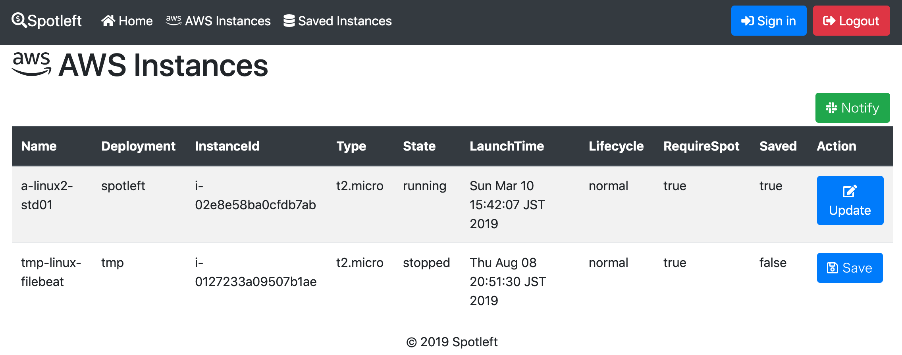
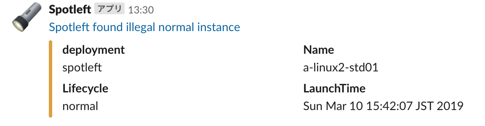
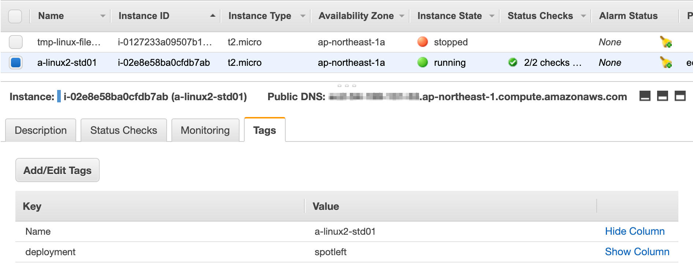

# Spotleft :flashlight:

Spotlight on AWS spot instance.

When you use AWS spot instance by Cloud Foundry BOSH, some instance will be started as normal after spot retirements. Spotleft detect illegal normal instance for saving your cost.



## Features
- List AWS instances.
- Save requirement state of instance's lifecycle (normal/spot). 
- Notify illegal normal instances to slack.



## QuickStart

1. Set Environment Variables on `Configuration`.
1. Run `mvn spring-boot:run`.
1. Access to `http://localhost:8080`.

## Configurations

| Setting               | Description                         | Example                                     |
| --------------------- | ----------------------------------- | ------------------------------------------- |
| AWS_ACCESS_KEY_ID     | Access key id for accessing AWS     | `AKIAXXX`                                   |
| AWS_SECRET_ACCESS_KEY | Secter access key for accessing AWS | `SECRET`                                    |
| DATABASE_URL          | URL for Database                    | `jdbc:mysql://DB_HOST:3306/spotleft`        |
| DB_USERNAME           | Database username                   | `spring`                                    |
| DB_PASSWORD           | Database password                   | `boot`                                      |
| SLACK_WEBHOOK_URL     | Slack incoming webhook URL          | `https://hooks.slack.com/services/XXX/XXX/` |
| SLACK_USERNAME        | Slack username on post              | `Spotleft`                                  |
| SLACK_CHANNEL         | Slack channel to post               | `#private`                                  |
| SLACK_ICON_EMOJI      | Slack emoji on post                 | `:flashlight:`                              |
| SPOTLEFT_URL          | Slack message link URL              | `http://localhost:8080`                     |
| SPOTLEFT_EXCLUDE_NAME | Exclude instance to notify          | `bosh-health-check`                         |
| SPOTLEFT_CRON         | Cron schedule to check and notify   | `0 0 0 * * SUN-SAT`                         |

`AWS_ACCESS_KEY_ID`, `AWS_SECRET_ACCESS_KEY` is able to be set via `~/.aws/credentials`.

```
[default]
aws_access_key_id = ACCESS_KEY_ID
aws_secret_access_key = SECRET_ACCESS_KEY
```

Ref: https://docs.aws.amazon.com/ja_jp/sdk-for-java/v1/developer-guide/credentials.html

## AWS instance tags
Spotleft expect **Name** and **deployment** tags on AWS instances. In case of BOSH, these tags are automatically set on deploy VMs.


